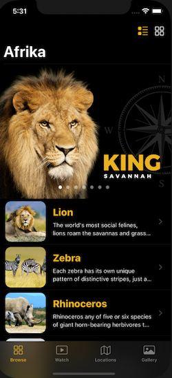

# Afrika
A SwiftUI app showcasing the animals in the Safari
SwiftUI 2.0 App

[![Swift Version][swift-image]][swift-url]
[![License][license-image]][license-url]

This SwiftUI App allows a user to explore popular animals of Africa. 



## Features
1. Simple animations
2. Web Links
3. Custom Modifiers
4. Embeded Videos
5. Stickers
6. MapKit
7. Custom Grid Layout

## Requirements 
- iOS 14.1+
- Xcode 9.3+

## Installation
1. Download and drop ```Afrika.swift``` in your project.  

[swift-image]:https://img.shields.io/badge/swift-5.0-orange.svg
[swift-url]: https://swift.org/
[license-image]: https://img.shields.io/badge/License-MIT-blue.svg
[license-url]: https://opensource.org/licenses/MIT
